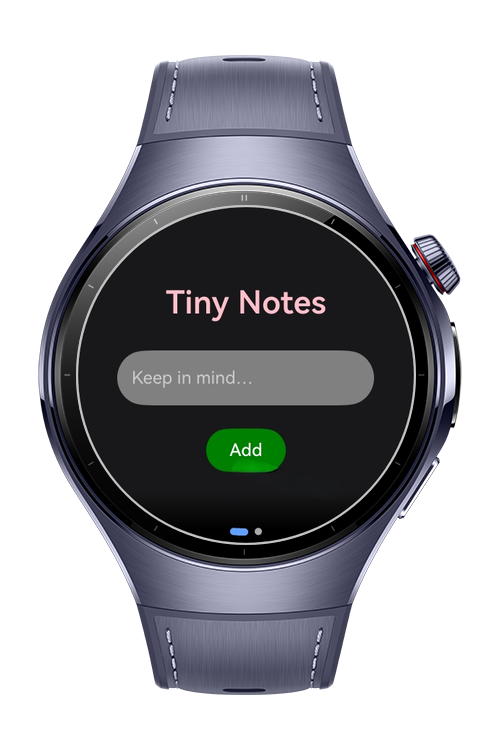
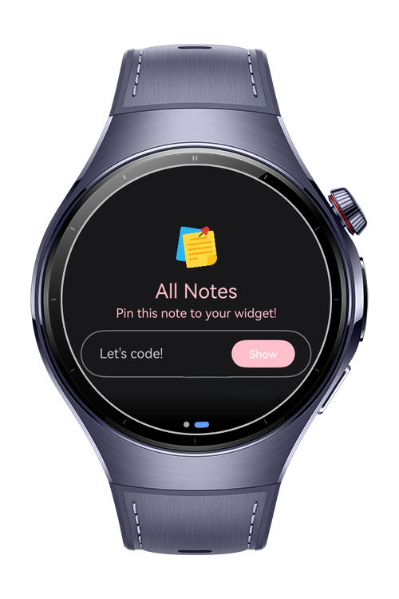
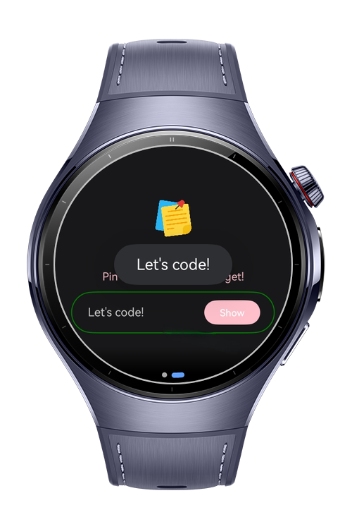
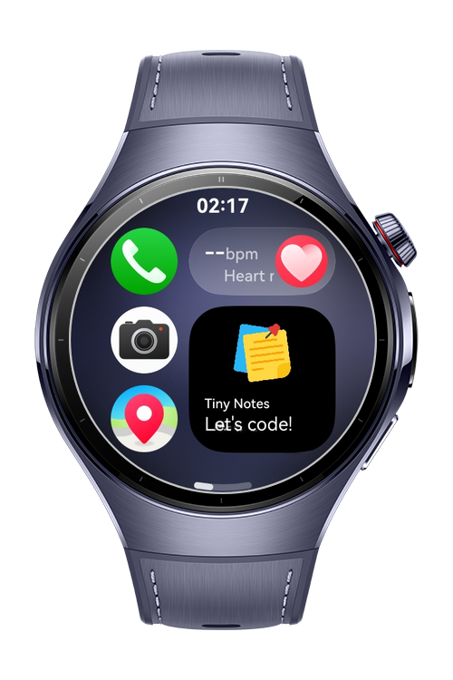

> **Note:** To access all shared projects, get information about environment setup, and view other guides, please visit [Explore-In-HMOS-Wearable Index](https://github.com/Explore-In-HMOS-Wearable/hmos-index).

# Tiny Notes
Tiny Notes is a quick and simple way to save short reminders, keep-in-mind messages, and daily thoughts. Add a note in seconds, view them instantly, and pin your important ones to the widget. Stay organized with minimal effort.

# Preview
<div>
	
	
	
	
</div>

# Use Cases

***Quick Note Add:*** Users can instantly save short reminders with a single input.
***Swipe Navigation:*** ArcSwiper lets users switch smoothly between add and list views.
***Show in Widget:*** Users can pin a selected note directly to the home-screen widget.

# Tech Stack

- Languages: ArkTS (Ark TypeScript)

- Frameworks: HarmonyOS SDK 5.1.0 (API Version 18)

- Tools: DevEco Studio Version 5.1.0.842

- Libraries & Kits:
    - @kit.FormKit	Used for creating and managing actionable widgets.
    - @kit.AbilityKit	Enables app launch logic and intent routing via WantAgent.
    - @kit.BasicServicesKit	Provides BusinessError for handling exceptions and service errors.
    - @kit.PerformanceAnalysisKit	Utilized for logging and debugging via hilog.

# Project Directory

```
|--- entryability
|     |--- EntryAbility.ets        # Main app entry point

|--- entryformability
|     |--- EntryFormAbility.ets    # Entry for widget / form extension

|--- pages
|     |--- Index.ets               # App initialization & routing entry
|     |--- tinynotes
|           |--- TinyNotesCard.ets # Widget card UI for showing selected note

|--- utils
|     |--- Logger.ets              # Lightweight logging helper
|     |--- PreferencesUtils.ets    # Local storage helper for notes & state

```

# Constraints and Restrictions

## Supported Devices

- Huawei Watch 5
- Devices running HarmonyOS 5.1.0 (API 18) and above

# Licence

Tiny Notes is distributed under the terms of the MIT License
See the [LICENSE](./LICENSE) for more information.
